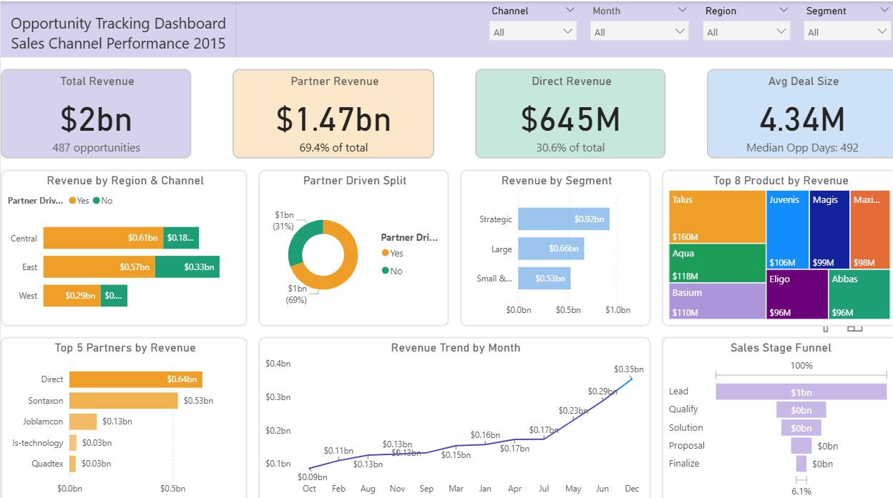
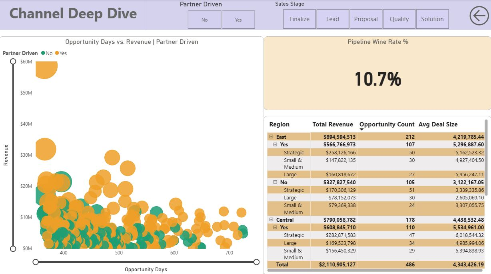

# Power BI Opportunity Tracking Dashboard — Sales Channel Performance

> An executive-grade Power BI solution delivering end-to-end visibility into a $2.1B sales pipeline across partner and direct channels, three regional markets, and multiple customer segments. Designed to surface pipeline risk, channel efficiency, and revenue concentration so that sales leaders and executives can act with confidence rather than assumption.

This dashboard translates raw opportunity data into a strategic command center — enabling sales managers to prioritize high-value partners, identify at-risk pipeline stages, and monitor seasonal revenue patterns across the full opportunity lifecycle.

---

## Table of Contents

- [Business Problem](#business-problem)
- [Dashboard Overview](#dashboard-overview)
- [Key KPIs](#key-kpis)
- [Dashboard Pages & Visuals](#dashboard-pages--visuals)
- [Key Business Insights](#key-business-insights)
- [Strategic Recommendations](#strategic-recommendations)
- [Tools & Technologies](#tools--technologies)
- [Dashboard Features](#dashboard-features)
- [Business Impact](#business-impact)
- [Dashboard Preview](#dashboard-preview)

---

## Business Problem

Sales organizations managing large, multi-channel pipelines routinely struggle with a fundamental visibility gap: headline pipeline numbers look healthy while the realistically closeable revenue is far smaller. Without a structured view of channel contribution, stage-level weighting, and partner concentration, revenue forecasts become unreliable and strategic investments get misallocated.

This dashboard was built to address four core challenges:

**Partner dependency without transparency.** When a single partner or channel dominates revenue, the business carries concentration risk that traditional CRM reports rarely surface clearly. Executives need to see this risk quantified — not buried in spreadsheet exports.

**Sales funnel distortion.** Top-of-funnel inflation — where the majority of pipeline value sits in the lowest-probability Lead stage — creates a false sense of security. Decision-makers need stage-weighted pipeline views to understand what revenue is actually closeable within a planning horizon.

**Regional performance gaps.** In multi-region organizations, aggregate revenue numbers mask vastly different channel dynamics across geographies. A region that appears to underperform may simply need a different go-to-market strategy rather than additional headcount.

**Sales cycle length as a hidden inefficiency.** A median opportunity age of 492 days is not a pipeline — it is a holding pattern. Without tools to identify which partners, regions, or segments are driving the longest cycles, coaching resources get applied broadly rather than where they will have the greatest impact.

---

## Dashboard Overview

The Opportunity Tracking Dashboard is a two-page interactive Power BI report providing a comprehensive view of $2.1B in sales pipeline performance for the 2015 period. It spans 487 opportunities across three regions (East, Central, West), two sales channels (Partner-Driven and Direct), and three customer segments (Strategic, Large, Small & Medium).

**Executive Overview** consolidates the most critical performance indicators onto a single page — total and segmented revenue, partner vs. direct channel split, regional contributions, sales stage funnel health, top partner and product rankings, and a full-year monthly revenue trend.

**Channel Deep Dive** provides the analytical layer beneath the summary — a scatter plot correlating opportunity age with deal size by channel, a detailed regional breakdown table with drill-down by segment, and the overall pipeline win rate, enabling sales managers to investigate performance drivers at the partner, region, and segment level.

Filters for Channel, Month, Segment, and Region allow executives and analysts to dynamically slice the data without leaving the report.

---

## Key KPIs

| KPI | Value | Context |
|---|---|---|
| **Total Revenue** | $2.11B | Combined partner and direct pipeline |
| **Partner Revenue** | $1.47B | 69.4% of total revenue |
| **Direct Revenue** | $645M | 30.6% of total revenue |
| **Opportunity Count** | 487 | Total active opportunities tracked |
| **Average Deal Size** | $4.34M | Blended across all channels and regions |
| **Median Opportunity Days** | 492 days | Median age of open opportunities |
| **Pipeline Win Rate** | 10.7% | Overall conversion rate across all stages |
| **Top Partner Revenue** | $526M (Sontaxon) | 36% of all partner revenue |
| **East Region Revenue** | $894.6M | Largest revenue-generating region |
| **Central Region Revenue** | $790.1M | Highest partner revenue concentration |

---

## Dashboard Pages & Visuals

### Page 1 — Executive Overview

**Partner-Driven Revenue Split**
A donut chart at the top of the page visually communicates the 69%/31% split between partner-driven and direct revenue, with absolute values of approximately $1.47B and $645M respectively. This is the dashboard's opening statement of channel dependency.

**Headline KPI Cards**
Four KPI cards anchor the top of the page: Total Revenue ($2.11B), Partner Revenue ($1.47B, 69.4% of total), Direct Revenue ($645M, 30.6% of total), and Average Deal Size ($4.34M). A fifth metric — Median Opportunity Days (492) — provides immediate context for sales cycle health.

**Revenue by Region & Channel**
A grouped bar chart breaks total revenue into East ($0.61B partner / $0.33B direct), Central ($0.61B partner / $0.18B direct), and West regions, with partner and direct channels shown side by side. This visual immediately surfaces the partner dominance in Central and the relative balance in East.

**Revenue by Segment**
A horizontal bar chart compares revenue across three customer segments: Strategic ($0.92B), Large ($0.66B), and Small & Medium ($0.53B). This view informs where the company has its strongest market penetration and where growth headroom exists.

**Sales Stage Funnel**
A funnel chart tracks opportunity progression through five stages — Lead, Qualify, Solution, Proposal, and Finalize. The funnel makes the top-heaviness of the pipeline instantly visible: the Lead stage holds 100% of the funnel volume, with each subsequent stage representing a dramatic drop in count and weighted value.

**Top 5 Partners by Revenue**
A horizontal bar chart ranks the five largest revenue-generating partners: Direct ($0.64B), Sontaxon ($0.53B), Joblamcon ($0.13B), Is-technology ($0.03B), and Quadtex ($0.03B). The sharp cliff between Sontaxon and the third-ranked partner makes concentration risk unmistakable.

**Top 8 Products by Revenue**
A column chart ranks the eight highest-revenue products: Talus ($160M), Aqua ($118M), Basium ($110M), Juvenis ($106M), Magis ($99M), Maximus ($98M), Eligo ($96M), and Abbas ($96M). Revenue distribution across the top products is relatively compressed, with no single product dominating.

**Revenue Trend by Month**
A line or bar chart traces monthly revenue across the full year, revealing strong year-end seasonality — February is the highest single month at $354M, with a secondary concentration in July ($288M). January through April represent the softest revenue period.

**Interactive Filters**
Slicers for Channel, Month, Segment, and Region allow any stakeholder to customize their view of the data without navigating away from the Executive Overview.

---

### Page 2 — Channel Deep Dive

**Opportunity Days vs. Revenue Scatter Plot**
A bubble scatter plot maps each opportunity by its age in days (x-axis, ranging from approximately 400 to 700 days) against its revenue value (y-axis, ranging from $0M to $60M). Bubbles are color-coded by channel — orange for Partner-Driven, green for Direct. The visualization immediately reveals that partner-driven deals tend to represent higher individual revenue values, and that a significant cluster of deals across both channels are concentrated in the 400–550 day range regardless of deal size.

**Pipeline Win Rate**
A large KPI card prominently displays the 10.7% overall pipeline win rate — the single most important efficiency metric for a sales leadership audience. Its visual prominence on this page signals that this number demands attention.

**Regional Breakdown Table**
A hierarchical matrix table provides drill-down detail by Region → Channel → Segment, showing Total Revenue, Opportunity Count, and Average Deal Size for each combination. Key data points include:

- East: $894.6M total / 212 opportunities / $4.22M avg deal size
  - Partner-Driven (Yes): $566.8M / 107 opps / $5.30M avg
  - Direct (No): $327.8M / 105 opps / $3.12M avg
- Central: $790.1M total / 178 opportunities / $4.44M avg deal size
  - Partner-Driven (Yes): $608.8M / 110 opps / $5.53M avg
- **Total: $2.11B / 486 opportunities / $4.34M avg deal size**

This table enables sales managers to identify exactly where average deal sizes are strongest and where pipeline volume is concentrated.

**Partner Driven & Sales Stage Filters**
Button-style filters for Partner Driven (Yes/No) and Sales Stage (Finalize, Lead, Proposal, Qualify, Solution) allow granular exploration of the scatter and table data, enabling targeted analysis of specific sub-segments of the pipeline.

---

## Key Business Insights

**1. The partner channel is the company's primary growth engine.**
Partner-driven opportunities account for $1.47B — more than twice the revenue generated through the direct channel ($645M). Partner deals also carry a meaningfully higher average deal size, suggesting that partner-led engagements tend to land in larger, more strategic accounts.

**2. A single partner relationship represents an existential revenue risk.**
Sontaxon alone generated $526M — approximately 36% of all partner revenue. No other partner comes close; the second-largest, Joblamcon, generated $133M. This level of concentration means that losing or disrupting the Sontaxon relationship would remove more revenue than the entire direct channel in multiple regions.

**3. Regional go-to-market strategies are not uniform — and should not be treated as such.**
Central is almost entirely partner-dependent ($609M partner vs. $181M direct), while East is the only region where direct selling remains genuinely competitive. West underperforms in both channels and represents an unresolved strategic question — either an underserved market or a structurally difficult territory.

**4. The pipeline is inflated by low-probability top-of-funnel volume.**
The vast majority of pipeline revenue sits in the Lead stage, which carries only a 10% win probability. When pipeline is weighted by stage probability, realistically closeable revenue shrinks dramatically from the $2.11B headline figure. Executives relying on unweighted pipeline totals are likely overestimating near-term revenue.

**5. Revenue is heavily seasonal, with over-dependence on year-end closes.**
Revenue peaks sharply in February and again in July, while the first quarter beyond February represents the weakest stretch of the year. This pattern creates cash flow and forecasting risk if pipeline activity is not proactively managed during the slower months.

**6. Segment penetration is broadly distributed — but incomplete.**
Strategic accounts generate the most revenue ($919M), followed by Large ($664M) and Small & Medium ($528M). The relative closeness of these figures, combined with the fact that no segment is overwhelmingly dominant, suggests the company has not yet fully penetrated any of its target segments — a credible growth narrative for executive and investor audiences.

---

## Strategic Recommendations

**1. Rebalance investment toward partner enablement — decisively.**
The performance gap between partner and direct channels is not marginal. Partner-driven deals generate more than twice the revenue and command higher average deal sizes. Sales and marketing resource allocation should reflect this reality: training budgets, co-selling support, and marketing development funds should be weighted heavily toward partner-facing programs. The direct channel still warrants investment as a risk hedge — $645M in direct revenue is material — but attempts to scale it at the same rate as the partner program are unlikely to generate proportionate returns.

**2. Treat the Sontaxon relationship as a board-level risk item.**
A single partner representing 36% of partner revenue is a concentration risk that belongs on the executive agenda, not just the sales manager's task list. A dedicated partner success manager should be assigned to this account immediately. In parallel, the company should launch a structured partner development program with an explicit goal of bringing three to five additional partners into the $100M+ revenue tier within 24 months. A formal policy target — no single partner exceeding 20% of partner revenue — would provide a measurable commitment to diversification.

**3. Apply differentiated regional strategies rather than a uniform model.**
Central should lean fully into partner-led selling; the data shows that direct investment here is unlikely to generate competitive returns. East, by contrast, is the only region where direct selling holds its own — likely reflecting a different buyer profile — and direct sales resources there should be protected, not redeployed into partner management roles. West requires a dedicated pipeline review to determine whether it represents an underserved market worth pursuing or a territory that requires strategic recalibration.

**4. Introduce pipeline hygiene discipline to address stage stagnation.**
Opportunities that have remained in the Lead stage for more than 90 days without forward movement should be flagged for mandatory review and either advanced or closed out. Carrying stale leads artificially inflates pipeline totals and undermines forecast credibility. Sales coaching investment should be concentrated on the Qualify-to-Solution conversion, where the drop in weighted pipeline value is steepest and where a successful advance triples the probability-weighted value of the deal.

**5. Investigate and reduce the 492-day average sales cycle.**
A median opportunity age of nearly 500 days is a strong indicator that a meaningful portion of the pipeline consists of stalled or misqualified opportunities rather than deals genuinely progressing toward close. The scatter plot on Page 2 should be used to identify which partners, regions, or segments are associated with the longest cycles, enabling targeted intervention — whether through re-qualification, executive escalation, or formal deal closure — rather than broad sales process changes.

---

## Tools & Technologies

| Category | Details |
|---|---|
| **BI Platform** | Microsoft Power BI Desktop |
| **Data Visualization** | Interactive charts, funnel visuals, scatter plots, KPI cards, matrix tables |
| **Analytics Approach** | Sales pipeline analysis, channel performance benchmarking, segment analysis, revenue trend analysis |
| **Report Delivery** | Multi-page interactive Power BI report with dynamic slicers and drill-down |
| **Data Scope** | Sales opportunity data — revenue, deal size, opportunity age, pipeline stage, channel, region, segment, partner, product |

---

## Dashboard Features

- **Interactive cross-filtering** across Channel, Month, Segment, and Region slicers on both pages
- **Partner vs. Direct channel comparison** with revenue, opportunity count, and deal size breakdowns
- **Sales stage funnel visualization** tracking opportunity volume from Lead through Finalize
- **Scatter plot analysis** correlating opportunity age with deal revenue by channel
- **Regional performance comparison** with hierarchical drill-down to segment level
- **Partner revenue concentration analysis** highlighting top 5 partners by contribution
- **Product revenue ranking** across the top 8 revenue-generating products
- **Monthly revenue trend tracking** across the full year with seasonal pattern visibility
- **Pipeline win rate KPI** providing a single-number view of overall conversion efficiency
- **Executive KPI cards** for instant visibility into total revenue, channel splits, deal size, and cycle time
- **Multi-page navigation** enabling movement between executive summary and deep-dive analytical views

---

## Business Impact

**For Sales Managers**
This dashboard replaces manual pipeline reviews with a real-time, filterable view of every meaningful dimension of sales performance. Stage-level funnel visibility enables more accurate weekly forecasts, and the scatter plot provides a diagnostic tool for identifying which partners or regions are driving cycle-length inefficiencies — making coaching conversations more targeted and productive.

**For Executives and Senior Leadership**
The Executive Overview delivers a board-ready summary of channel dependency, partner concentration risk, and regional performance disparities in a single page. Executives can identify strategic risks — such as the Sontaxon concentration — and growth opportunities — such as the West region and underpenetrated segments — without requiring an analyst to produce a separate briefing.

**For Revenue Operations Teams**
The regional breakdown table and channel deep dive provide the granular data necessary to build accurate territory plans, set realistic quota targets, and allocate resources across regions and segments. The pipeline win rate and stage-level funnel make it possible to model the impact of conversion improvements on total closed revenue.

**For Partner Management Teams**
The Top 5 Partners visualization and the partner-filtered scatter plot provide a dedicated lens on the health and composition of the partner ecosystem. Partner managers can identify which relationships are generating outsized value, which are underperforming relative to their deal count, and where new partner investment should be directed to reduce concentration risk.

---

## About This Project

This dashboard was developed as a portfolio demonstration of enterprise-grade Power BI development, combining executive KPI design, multi-level drill-down analytics, and strategic business communication. All data, insights, and recommendations are derived directly from the dashboard visuals and analytical outputs.

---

*Built with Power BI Desktop · Sales Channel Performance 2015 · Opportunity Tracking Dashboard*
